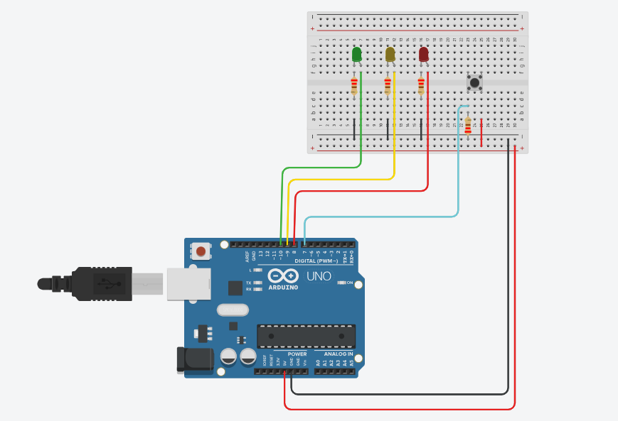
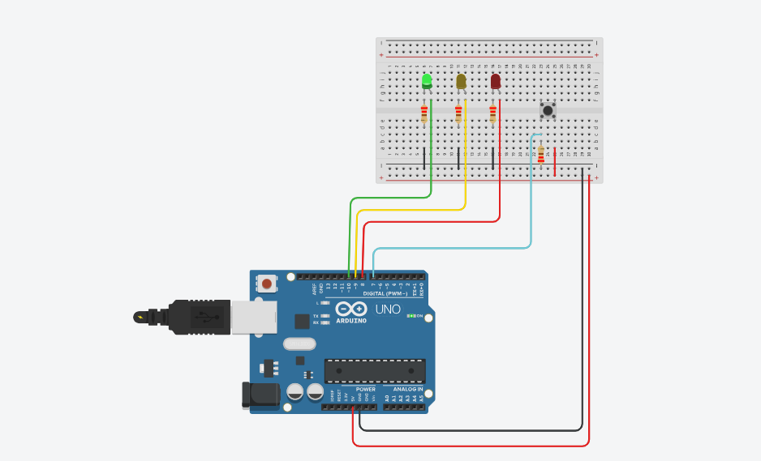
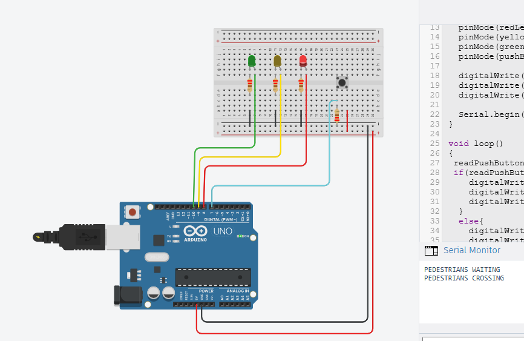

# 🚦 Arduino Traffic Light Controller with Pedestrian Crossing

## 📖 Overview

This project is an Arduino-based traffic light controller that simulates a real-world traffic intersection with a pedestrian crossing system.

The controller manages vehicle traffic using timed light sequences while allowing pedestrians to safely cross the road through a push-button request. The project was developed using Embedded C++ and simulated in Tinkercad.

---

## ✨ Features

- Automatic traffic light sequencing
- Pedestrian crossing button
- Safe pedestrian crossing cycle
- Timed traffic light control
- Arduino simulation using Tinkercad
- Embedded C++ implementation

---

## 🔧 Components Used

- Arduino Uno
- Red, Yellow, and Green LEDs
- Push Button
- Breadboard
- Jumper Wires
- Resistors

---

## 💻 Software

- Arduino IDE
- Embedded C++
- Tinkercad

---

## 📁 Repository Structure

Arduino-Traffic-Light-Controller-with-Pedestrian-Crossing
│
├── Code
├── Images
├── Simulation
└── README.md

---

## 📷 Screenshots

### Circuit Diagram

### Normal Traffic Operation

### Pedestrian Crossing

---

## ⚙️ System Workflow

1. Traffic lights operate in a timed sequence.
2. A pedestrian presses the crossing button.
3. The controller waits until it is safe to stop vehicle traffic.
4. Vehicle lights turn red.
5. Pedestrians are allowed to cross safely.
6. The normal traffic sequence resumes.

---

## 🚀 Future Improvements

- Countdown timer display
- Emergency vehicle priority
- Multiple road intersections
- Adaptive traffic control using sensors
- ESP32 implementation
- IoT traffic monitoring

---

## 🧠 Skills Demonstrated

- Embedded Systems
- Embedded C++
- Arduino Programming
- State Machine Design
- Timing Control
- Digital I/O
- Hardware Integration
- System Testing
